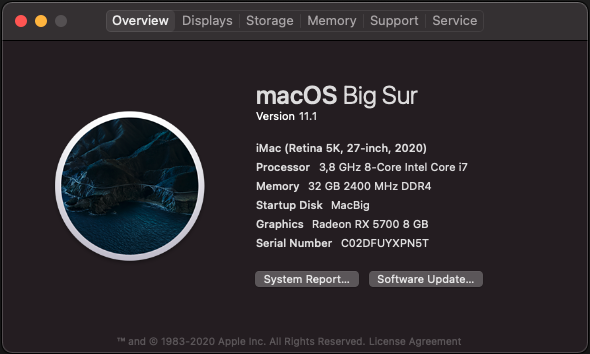

# Specifications

Hardware List: https://pcpartpicker.com/b/x33tt6
```
Gigabyte B460M Aorus Pro (Bios: F4)
 - Audio: Realtek® ALC1200 codec
 - Ethernet: Intel® Ethernet Connection I219V12
Intel Core i7 10700K
Ram 2 x 16GB DDR4 2400 MHz
SSD WD BLACK SN750 1TB NVME PCIe Gen3 x4 (WDS100T3XHC)
Gigabyte Radeon RX 5700 GAMING OC 8GB - Navi 10
Wifi + Bluetooth Bcm94360cd
Monitor HP V225hz && DELL P2219H (3840x1080)
```

- OpenCore 0.6.4
- OS: macOS 11.2 20D5029f x86_64
- Host: Hackintosh (SMBIOS: iMac20,2)
- Kernel: 20.3.0
- Resolution: 1920x1080 @ FHDHz, 1920x1080 @ FHDHz
- WM: Spectacle

# Install

Download and extract the last release EFI.zip to your the root of your EFI partition and update your SMBIOS values.

For minor hardware differences, like processor and GPU, see the full guide:
https://dortania.github.io/OpenCore-Install-Guide/

---

**SMBIOS:** Mac BIOS Info, on hackintosh is about your Mac fake IDs and Serials.
You can use OpenCoreConfigurator to OpenCore 0.6.4 to generate:
https://github.com/ic005k/QtOpenCoreConfig/releases/tag/20201215

## MacOs Kexts

- Lilu (1.5.0)
- AppleALC (1.5.5)
- NVMeFix (1.0.5)
- NoTouchID (1.0.4)
- WhateverGreen (1.4.5)
- VirtualSMC (1.1.9)
- SMCProcessor (1.1.9)
- SMCSuperIO (1.1.9)
- IntelMausi (1.0.4)

## Running SOs

- Windows 10
- Ubuntu 20.08 LTS
- MacOs 11.2

## Working

- Wifi + Bluetooth (Airdrop, AirPlay)
- LAN Ethernet
- Boot Audio
- SO Audio
- USB Ports
- GPU Aceleration (Dual Monitor+)
- Temperature, Power Sensors
- iServices (DO NOT FORGET, use your own SMBIOS)
- Full Dev Environment (Web, Android, iOs)
- Etc

## Not Working

- RGB Control (Only work on Windows)

## Images


