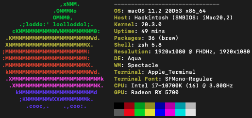

# Specifications

- OS: macOS 11.1 20C69 x86_64 
- Host: Hackintosh (SMBIOS: iMac20,1) 
- Kernel: 20.2.0 
- Uptime: 16 mins 
- Packages: 33 (brew) 
- Shell: zsh 5.8 
- Resolution: 1920x1080 @ FHDHz, 1920x1080 @ FHDHz 
- DE: Aqua 
- WM: Spectacle 
- Terminal: Apple_Terminal 
- Terminal Font: SFMono-Regular 
- CPU: Intel i7-10700K (16) @ 3.80GHz 
- GPU: Radeon RX 5700 
- Memory: 9070MiB / 32768MiB 

Hardware List: https://pcpartpicker.com/b/x33tt6

## OpenCore 0.6.4

### Working

- Everything that I know about

